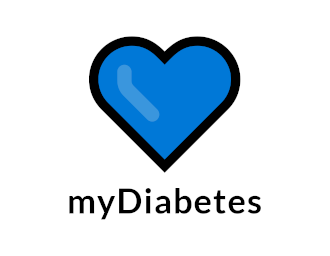
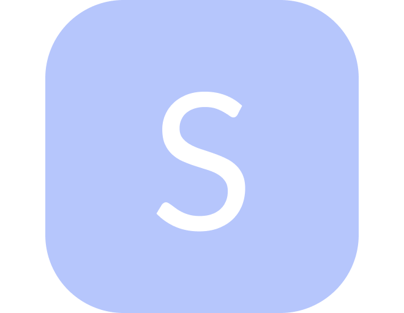

<!-- Readme inspired by https://github.com/DenverCoder1 -->

<!-- Header Text -->
<h3 align="center">
  Hi! I'm Piotr Piekarski
</h3>

<!-- Typing SVG by DenverCoder1 - https://git.io/typing-svg -->
<h3 align="center">
  
</h3>

<!-- Contact section -->

  
   
  
  

<!--end:Contact section-->

<!-- About me section -->
## 🐱‍👓 About me

  
  

    I'm currently working for <a href="https://www.softra.pl/"><b>Softra</b></a> as a Mobile Developer (<i>Android & Flutter</i>), In my free time I'm creating my own projects, mostly mobile apps. On weekends I'm studying computer science at 
    <a href="https://cdv.pl/"><b>Collegium Da Vinci</b></a>.
  

  

    Why am I programming? <b>Well, because i like it</b>. I mainly code apps to solve my given problem, this is how the best applications are born. Currently, I believe that mobile applications are an ideal means of combating various problems, which is why I deal with mobiles. Apart from these problems I also like to play games sometimes because of that my goal is to make a game🕹. In addition to IT, I like to go swimming or watch a good movie/tv series.
  

  

    You can write to me on one of the above communicators or if you want to talk about collaborate/work, please contact me at: ✉
    <a href="mailto:ppiekarski8@gmail.com"> 
      <b>ppiekarski8@gmail.com</b> 
    </a>
  

<!--end:About me section-->

<!-- Projects section -->
## 🚀 Projects
 

  
  

    <a href="https://github.com/piekarskipiotr/wake-on-lan"><b>wake-on-lan</b></a> is application that uses <i> Wake on LAN </i> technology, which allows you to start computers using the so-called <i>magic packages</i>. Thanks to the application you can track the current status of computers (<i>on / off</i>), create groups and enable all devices in a group to be started with one button. [<a href="https://github.com/piekarskipiotr/wake-on-lan">Show project</a>]
  

  

      Built with:  
      
       
      
  

    

 

  
  

     <a href="https://github.com/piekarskipiotr/mydiabetes"><b>mydiabetes</b></a> is project that provide diabetics with faster counting of products and finding them, it will allow you to forget about searching a notebook with stored products and save us from mistakes in calculations. Applications allows you to calculate products by 2 methods, searching products by barcode, creating meals by adding products to <i>food plate</i> and share your data with others users. [<a href="https://github.com/piekarskipiotr/mydiabetes">Show project</a>]
  

  

      Built with:  
      
       
      
      
  

   

 

  
  

    <a href="https://github.com/piekarskipiotr/stephanie"><b>stephanie</b></a> is a beautiful steganography app where you can conceal or reveal hidden secrets. [<a href="https://github.com/piekarskipiotr/stephanie">Show project</a>]
  

  

      Built with:  
      
       
  

      

 

<h4 align="center">More projects</h4>

  <a href="https://github.com/piekarskipiotr?tab=repositories&q=Android">👉🏻Android</a> 
  <a href="https://github.com/piekarskipiotr?tab=repositories&q=Flutter">👉🏻Flutter</a>
  <a href="https://github.com/piekarskipiotr?tab=repositories">👉🏻All</a>

 
<!--end:Projects section-->

<!-- Tech stack section -->
## 🐱‍💻 Things I code with and more

#### 👾 Languages

#### 💻 Others

<!--end:Tech stack section-->

<!-- User stats section -->
## ⚙️ Statistics

<!-- https://github.com/anuraghazra/github-readme-stats -->

 
  
🐱‍🏍 GitHub stats and time machine

   
  
  

    
    
  
  

<!-- https://github.com/jamesgeorge007/github-activity-readme -->

  
🦈 Recent activity on GitHub

   
  
  <!--START_SECTION:activity-->
1. 🎉 Merged PR [#6](https://github.com/piekarskipiotr/shopping-list-app/pull/6) in [piekarskipiotr/shopping-list-app](https://github.com/piekarskipiotr/shopping-list-app)
2. 💪 Opened PR [#6](https://github.com/piekarskipiotr/shopping-list-app/pull/6) in [piekarskipiotr/shopping-list-app](https://github.com/piekarskipiotr/shopping-list-app)
3. 🎉 Merged PR [#5](https://github.com/piekarskipiotr/shopping-list-app/pull/5) in [piekarskipiotr/shopping-list-app](https://github.com/piekarskipiotr/shopping-list-app)
4. 💪 Opened PR [#5](https://github.com/piekarskipiotr/shopping-list-app/pull/5) in [piekarskipiotr/shopping-list-app](https://github.com/piekarskipiotr/shopping-list-app)
5. 🎉 Merged PR [#4](https://github.com/piekarskipiotr/shopping-list-app/pull/4) in [piekarskipiotr/shopping-list-app](https://github.com/piekarskipiotr/shopping-list-app)
  <!--END_SECTION:activity-->

<!--end:User stats section-->

 
 

<!-- Little footer ninja cat d-_-b section -->

🐱‍👤

<!--end:footer-->
 
<!--links-->

  <!--my university-->
  <!--[cdv]: https://cdv.pl/-->

  <!--projects-->
  <!--[mydiabetes]: https://github.com/piekarskipiotr/MyDiabetes-->
  <!--[wol]: https://github.com/piekarskipiotr/WakeOnLAN-->

  <!--socials and contact-->
  <!--[linkedin]: https://www.linkedin.com/in/piekarskipiotr/-->
  <!--[discord]: xazai#2853-->
  <!--[twitter]: https://twitter.com/xazai_-->
  <!--[instagram]: https://www.instagram.com/piekarskiski/-->
  <!--[gmail]: mailto:ppiekarski8@gmail.com-->

<!--end:links-->
